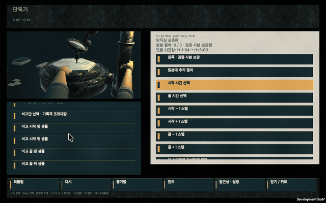
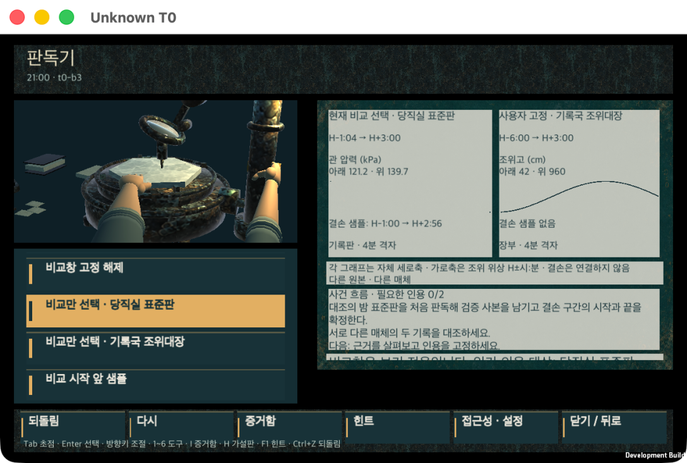
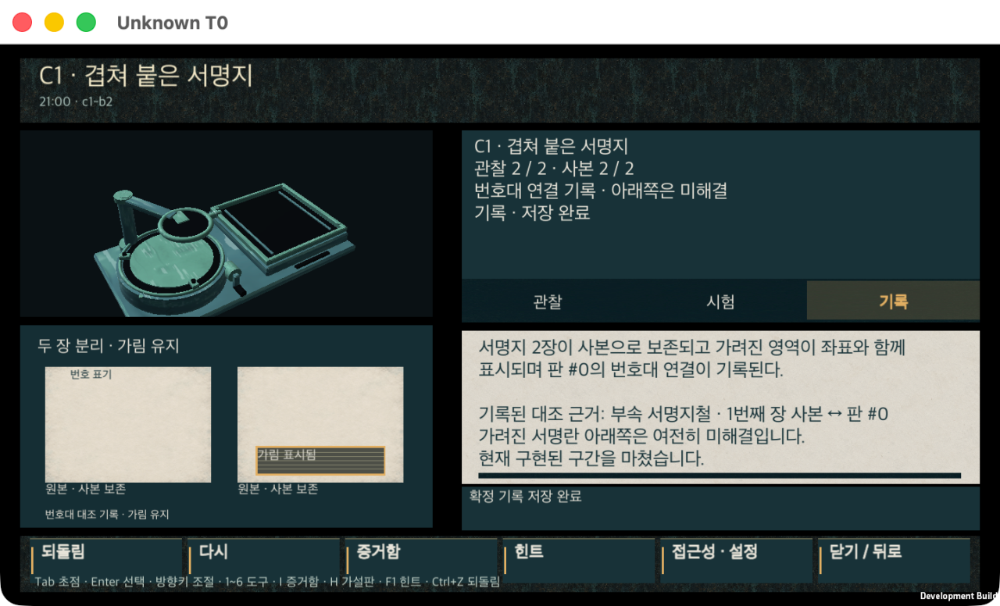
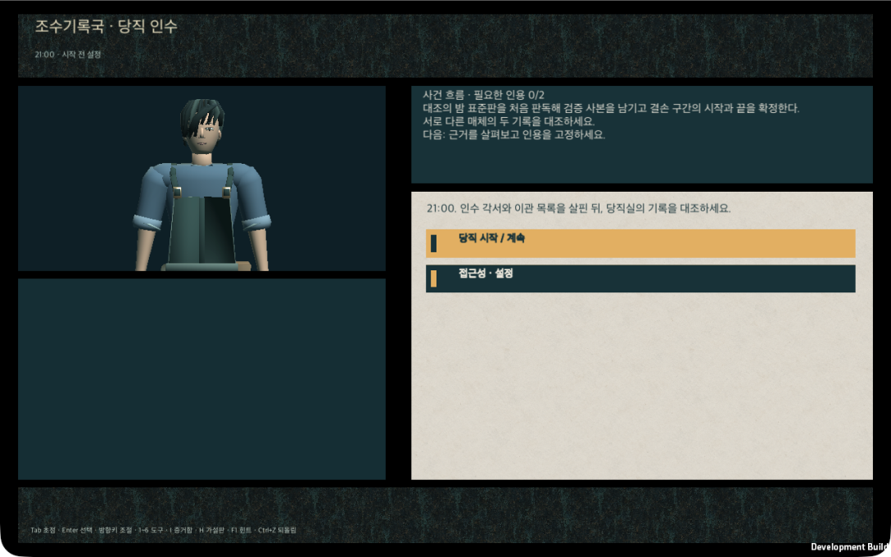
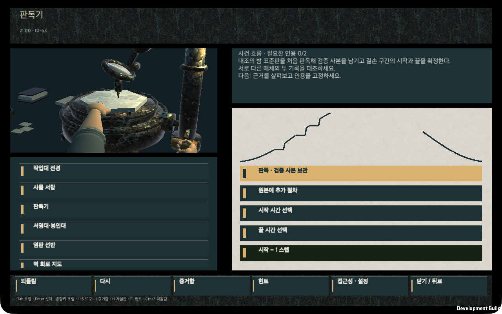
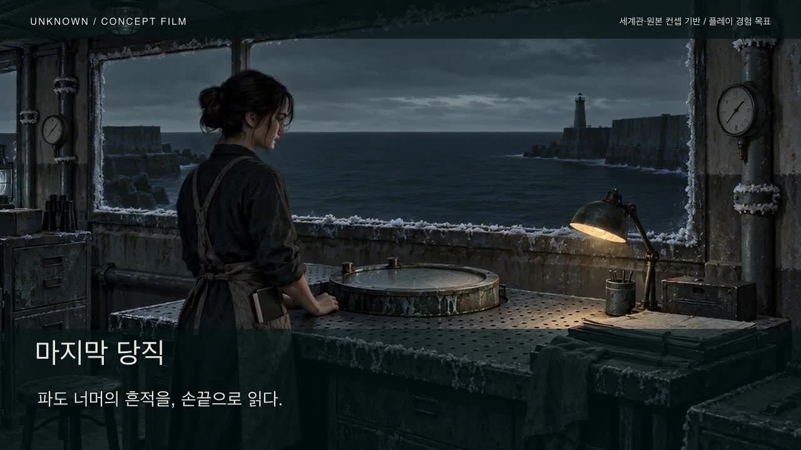
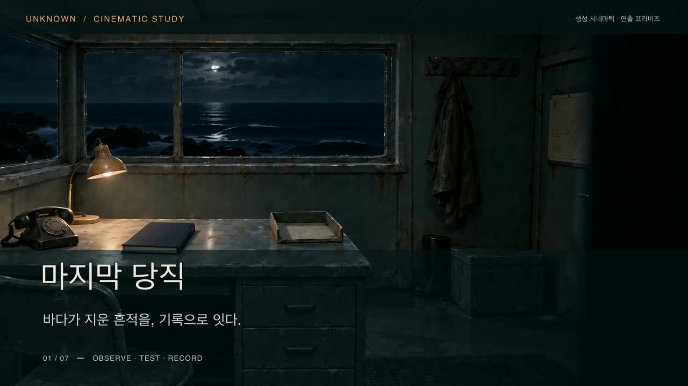

# 조수기록국: 마지막 당직 (가제)

> **Working title — unapproved.** 국문 가제와 영문 코드네임은 상표·동명 게임 확인 전이며 폴더명·번들명·상점명에 쓰지 않습니다. 저장소·Unity 프로젝트 코드네임은 `Unknown`입니다.
>
> 이 저장소는 Steam 프리미엄 Unity 신작의 **사전제작(preproduction)** 저장소입니다. 컨셉·프리비주얼라이제이션 이미지와 개발 빌드의 게임 내 UI 캡처를 구분해 표기합니다. 사람 플레이·성능·판매 실측은 아직 **n = 0** 입니다.

## 최신 플레이 영상 · M24 (2026-09-14)

[](docs/media/gameplay-m24/gameplay.mp4)

**[18초 플레이 영상 보기](docs/media/gameplay-m24/gameplay.mp4)** · [캐릭터 시작 화면](docs/media/gameplay-m24/title.png) · [두 기록 대조](docs/media/gameplay-m24/comparison.png) · [Blender 디테일 전후 비교](docs/media/gameplay-m24/blender-detail-comparison.png)

- **캐릭터:** Blender에서 얼굴 윤곽·눈/코/입, 비대칭 머리의 연속 면과 가닥, 소매 주름·앞치마 봉제선/리벳을 다듬었습니다. 전신은 15,124 → **19,618 tri**, 50본이며 기존 20k 상한 이내입니다. 양손 형상·리그·11 take·접촉 시간은 유지했습니다.
- **영상:** 진단 플래그 없는 같은 macOS 개발 빌드의 **타이틀 → 판독 → 서로 다른 기록 대조** 세 구간입니다. T0-b3 격리 체크포인트에서 재개한 에이전트 조작이며 연속 완주나 사람 플레이가 아닙니다. OS 창틀 제거·구간 편집·30fps 인코딩만 적용했고 오디오는 없습니다. Blender 비교 이미지는 별도의 렌더입니다.
- **검증:** 새 Blender 출력 15개와 리그/클립 계약, Unity 임포트, 기본 빌드 315파일/**411,041,089B**, 실제 손 접촉·복귀와 비교 전후 저장 해시 불변을 확인했습니다. 아래 M23의 187개 테스트는 당시 증거이며 M24에서 재실행한 수치가 아닙니다. 30fps는 영상 규격이지 성능 실측이 아닙니다.
- **경계:** 원본 후보 `runtimeEligible:false`, 사람 n=0·Base/R8/R9·강한 P1/P2 보존 감사·Windows/전체 캠페인·상업 승인 상태는 유지합니다. M22/M23 영상과 영수증을 덮어쓰지 않았습니다.

[M24 Blender 원본 · 납품 커밋 고정](https://github.com/akillness/unknown/blob/86fb88fa06cd72ffd5f777eb9ecf0fe0e81faace/assets/generated/3d/seorin-m22/r01/Seorin_Character.blend) · [정확한 M24 검증 영수증](_workspace/current/systems/tech-verification/m24/verification.json) · [영상 출처와 편집 구간](docs/media/gameplay-m24/provenance.json)

## 이전 코어 구현 · M23 (2026-09-14)

두 기록의 **동시 비교**, 직접 고르는 **서명 근거와 출처 계보**, 본편과 격리된 **조위정합 연습장**, 스크롤해도 유지되는 **작업저장·미리보기·확정저장 피드백**을 구현했습니다. 미기록 후보는 확정을 막으며 이전에 기록한 근거는 보존합니다. 같은 원본의 사본을 독립 근거로 세지 않습니다.

| M23 최종 두 자료·시간창 동시 비교 · 150% | 초기 35ebdc5 확정 후 내구 저장 피드백 · 150% |
|---|---|
|  |  |

- **검증:** Unity 프로젝트 고유187개 통과(EditMode64 + 최신 PlayMode122 + 별도 boot1). 외부 예제와 반복 실행은 제외합니다. macOS315파일/410,875,921B에서 판독기 밖 Undo→Redo→재진입에도 pin이 되살아나지 않음을 직접 확인했습니다. 초기177·첫 교정186·정합150%/저장 격리·서명 재시작 증거는 원래 빌드별로 보존합니다. OS 재부팅·사람 이해·Windows 성능 증거는 아닙니다.
- **실행:** 로컬 `unity/Unknown/Builds/T0-mac/Unknown.app`. 별도 연습장은 Editor 또는 네이티브 실행 인자 `--m23-alignment-practice`에서만 열립니다. 정식 초회 평가에는 이 인자를 쓰지 않습니다.
- **경계:** 현재 범위는 T0→C1-b2입니다. 사람 n=0, 강한 P1/P2 보존 감사 blocked, R8/R9 Base gate와 전체450–540분·Windows 실측은 미충족입니다. M20 r02·미승인 아트/상업 상태를 승격하지 않았습니다.

[구현 결과·리뷰·개선 계획](_workspace/current/handoff/m23-results-and-improvement-plan.md) · [정확한 실행 영수증](_workspace/current/systems/tech-verification/m23/verification.json) · [사람 평가 준비/미측정 경계](_workspace/current/qa/m23-human-evaluation.md)

## 이전 기반 빌드 · M22 (2026-09-13)

Blender MCP에서 직접 저작한 **한서린과 조작용 양손**을 기본 개발 빌드에 적용했습니다. 짧은 비대칭 머리, 말아 올린 소매와 작업 앞치마를 유지하고, 손의 엄지 방향·접촉 위치·화면 밖으로 이어지는 소매를 실제 Unity 화면에서 교정했습니다.

| 시작 화면의 한서린 | 실제 판독 중 손잡이 접촉 |
|---|---|
|  |  |

[판 삽입·복귀 영상](docs/media/gameplay-m22/plate-insert.mp4) · [판독·크랭크 영상](docs/media/gameplay-m22/reader.mp4) · [모션 축소 영상](docs/media/gameplay-m22/reduced-read.mp4) · [문서 화면의 양손](docs/media/gameplay-m22/document-hands.png)

- **플레이 리듬:** 무료 힌트의 대기·재제안 쿨다운은 각각 180초입니다. 제안의 보기·닫기는 키보드로 접근할 수 있고, Tab·포인터 이동 중 사라지지 않습니다. 문서 열람 중에는 방해하지 않으며 힌트 수준을 자동 공개하지 않습니다.
- **조작 피드백:** 성공한 판독에서만 크랭크가 움직입니다. 오른손은 손잡이를 따라가고, 삽입·확정 후 왼손은 복귀합니다. 모션 축소·화면 이탈·앱 중단·창 포커스 상실에서 멈추며 복귀 후 밀린 동작을 재생하지 않습니다. 내구 저장 실패를 성공 동작으로 꾸미지 않습니다.
- **검증:** EditMode **56**, PlayMode **100**, 별도 격리 부팅 **1**, 고유 **157건** 통과. 진단 플래그 없는 macOS 빌드를 실제로 조작했습니다. 영상의 30fps는 인코딩 규격이며 성능 실측이 아닙니다.
- **네이티브 힌트 확인:** [150% 제안·키보드 초점](docs/media/gameplay-m22/hint-offer-150.png) · [Enter로 닫은 뒤 판독기 유지](docs/media/gameplay-m22/hint-dismiss-150.png) · [자동 공개 없는 도움 메뉴](docs/media/gameplay-m22/hint-help-unrevealed-150.png). 180초 설정을 단축하지 않은 실제 대기·재제안과 입력을 확인했습니다.

실행 파일의 작업 경로: `unity/Unknown/Builds/T0-mac/Unknown.app` (현재 빌드로 갱신됨) · [당시의 정확한 검증 영수증](_workspace/current/systems/tech-verification/m22/verification.json) · [M22 Blender 원본 · 이전 커밋 고정](https://github.com/akillness/unknown/tree/fdcdc27e7dbda829f253f8cee0266f6b1427f27b/assets/generated/3d/seorin-m22/r01/) · [비교작 조사와 적용 범위](_workspace/current/planning/t0-research-to-implementation-r01.md)

기존 인물·삽입·판독 영상은 교정 전 M22 네이티브 빌드이며, 새 힌트 스틸은 입력·중단 계약 교정 후 빌드입니다. 두 빌드 지문과 캡처 범위는 각각 [모션 출처](docs/media/gameplay-m22/provenance.json)와 [힌트 UI 출처](docs/media/gameplay-m22/native-contract-provenance.json)에 분리했습니다.

위 M22 단락의 영상·수치는 이전 빌드의 역사적 증거입니다. 최신 캐릭터/영상은 위 M24, 코어 구현은 M23 기록을 따릅니다. M20 r02는 기본 적용 보류를 유지하며, 본 검증은 완성판·상업 라이선스·사람 플레이·480분 완주 승인이 아닙니다.

## 기존 세계관 컨셉


## 원본 컨셉 기반 영상 · M7

[](docs/media/concept-first-m7/cinematic.mp4)

[24초 시네마틱](docs/media/concept-first-m7/cinematic.mp4) · [32초 플레이 경험 목표](docs/media/concept-first-m7/gameplay-method.mp4) · [영상·GTI 키프레임 모음](docs/media/concept-first-m7/index.html)

**세계관·초기 원본 컨셉 → 영상 아트 목표 → GTI 텍스처·리소스 → 프리팹 재구성** 순서로 제작합니다. 현재 게임 화면·프리팹·런타임 리소스와 M5/M6 파생 이미지는 이번 영상의 참조에서 제외했습니다. 넓은 당직실, 소금 결정판, 원형 광학 장치와 제3수문의 물성을 새 시각 기준으로 삼습니다.

이 영상은 앞으로 구현할 플레이 경험의 목표이며, 현재 플레이 녹화나 저장·해금 구현의 증거가 아닙니다. 새 GTI 광학 작업대 키프레임과 영상은 제작됐고, 텍스처 맵과 프로젝트 프리팹 재구성은 [후속 제작 계약](_workspace/current/handoff/concept-first-m7-resources.json)에 명시했습니다.

<details>
<summary>이전 M6 기록 — 새 아트 기준에서 제외</summary>

### M6 이전 구현 비교 기록

[](docs/media/cinematic-gameplay-m6/cinematic.mp4)

[36초 시네마틱](docs/media/cinematic-gameplay-m6/cinematic.mp4) · [54초 플레이 방식](docs/media/cinematic-gameplay-m6/gameplay-method.mp4) · [두 편 함께 보기](docs/media/cinematic-gameplay-m6/index.html)

Higgsfield **MCP**로 만든 4개 샷에 M5 Unity 실제 녹화, 한국어 안내와 조용한 환경음을 편집했습니다. 당직실 인트로부터 관찰·시험·사본 보존·기록 저장까지 보여주며, T0 → C1 순찰 → 서명지 작업의 해금 조건을 설명합니다. 앞선 해금은 규칙 설명이고 실제 녹화의 순찰 전환은 저장 상태 복원입니다. 연속 플레이 녹화나 새 런타임 구현의 증거가 아닙니다. 현재 플레이 범위는 **C1-b2까지**이며 이후 단계는 제작 예정입니다.

[제작·출처 기록](assets/generated/previz/cinematic-gameplay-m6/provenance.json) · [편집 검수](_workspace/current/systems/tech-verification/cinematic-gameplay-m6/editorial-review.md)


</details>

## 검토 노트 · M8

[AI 게임 사례를 다룬 글](https://mp.weixin.qq.com/s/YmqCm2Hh8l6WPTIAIEMFhQ)을 참고해 자료 목록에 **검토 노트**를 추가했습니다. 자기 말로 가설을 적고, 직접 확인한 출처를 연결해 다음 검토 질문과 함께 살펴볼 수 있습니다. 메모는 선택 사항이며 기존 도구 조작으로 계속 진행할 수 있습니다.

확인한 자료의 관계에 따라 저작된 질문을 보여주는 오프라인 기능입니다. 자유문장의 의미를 AI가 판정하지 않으며, 메모 보관과 게임의 증거 확정·해금은 분리되어 있습니다. 첫 자료 확인으로 진행 기록이 저장된 뒤 메모를 따로 보관할 수 있고, 그전 초안은 실행 중에만 유지됩니다.

[설계와 원문 적용 범위](_workspace/current/planning/ai-native-m8-reference-application.md) · [M7 기반 노트 연출·GTI 후속 자원](_workspace/current/presentation/ai-native-m8-direction.md) · [검증 기록](_workspace/current/systems/tech-verification/ai-native-m8/verification.md)

## 한 줄 소개

3주 전에 폐국을 고지한 조수기록국의 이관 전 마지막 야간 당직. 기록 복원사 **한서린**은 끊긴 염선 배선과 배수 경로를 **손으로 직접 바꾸고**, 그 결과로 달라진 항구를 다시 조사해 12년 전 **대조의 밤**에 사라진 **결손 4시간**의 진실을 청문 문서 한 건으로 확정합니다. 밤은 21:00에 시작해 05:00에 끝나고, 세 갈래 결말은 전부 본편 안에서 닫힙니다.

**장르** 작업대·공간 추리 어드벤처 (2.5D 고정 시점, 싱글플레이) · **엔진** Unity 6000.5.6f1 · **플랫폼 목표** PC (Steam) · **언어** 한국어 / 영어 · **전투·유료 재화·멀티플레이 없음**

## 개발 빌드 게임플레이 UI


**작업대·공간 추리 어드벤처**입니다. 허브의 사물 서랍·판독기·회로 조작을 오가며 자료를 선택하고, 시간창을 단계별로 조정해 근거를 가설에 인용합니다. 위 이미지는 Unity `Unknown T0` 개발 빌드에서 캡처한 게임 내 UI이며, 완성판 게임플레이나 사람 플레이 검증을 뜻하지 않습니다.

## 세 기둥

1. **행동으로 추리한다.** 단서를 모으는 데서 끝나지 않고 배선·경로·기록의 가설을 손으로 시험합니다.
2. **같은 장소가 다르게 읽힌다.** 새 지역을 늘리는 대신 허브 1곳 + 구역 4곳을 상태 변화로 재사용합니다.
3. **본편만으로 닫힌다.** 도시의 위기, 사건의 책임, 주인공의 선택이 본편에서 끝납니다. DLC는 다른 사건입니다.

## 플레이 컷씬 (프리비즈)

| 도구 조작 → 공간 변화 → 새 질문 (Higgsfield image-to-video, 10초) | 허브 당직실 그레이박스 턴테이블 (Blender) |
|---|---|
|  |  |

컨셉 프레임 9장으로 만든 스토리보드 GIF는 [docs/media/previz-cutscene-concept.gif](docs/media/previz-cutscene-concept.gif) 에 있습니다. 두 GIF 모두 `docs/media/provenance.json`에 출처와 "NOT gameplay" 표기가 있습니다.

## 여섯 개의 동사 — 세계의 여섯 법칙과 1:1

| 동사 | 대응 법 | 연습(sandbox)에서 | 확정(commit)에서 |
|---|---|---|---|
|  **배선 추적** `circuit` | 배선된 것만 남는다 | 계통선을 따라 센서 범위 안/밖을 비교 | 확정 없음 — 배선 밖 근거를 무효로 만든다 |
|  **판독** `reader` | 원본은 닳지만 사본은 남는다 | 검증 사본을 무제한 재생·확대 | 판독 결과를 가설판에 출처와 함께 고정 |
|  **조위정합** `alignment` | 정합 전 시계는 믿지 않는다 | 공통 피크 3개를 잡으며 잔차를 실시간 확인 | 잔차 ≤ 4분일 때 두 자료의 시간축을 잇는다 |
|  **배수 편성** `routing` | 이번 조수에는 보호 용량이 부족하다 | 두 경로를 대기 상태로 편성해 결과를 미리 본다 | 우선순위를 확정해 구역 상태를 실제로 바꾼다 |
|  **부식 시험** `corrosion` | 소금은 비용으로 보인다 | 구성안을 가상 시험대에 무제한 올린다 | 한도 안의 구성만 배수 편성 확정으로 넘긴다 |
|  **이중서명** `seal` | 원본 책임과 제출을 나눈다 | 결론 카드에 근거 슬롯을 채워 본다 | 서로 다른 매체 2종 + 배선 범위 안 + 시간 근거로 제출 |

모든 조작은 **연습(무제한·무료·세계 불변)** 과 **확정(프리뷰 → 저장 성공 후에만 세계 변경)** 두 층으로만 존재합니다. 힌트 3단계는 무료·무제한이고 엔딩·평가에 영향이 없습니다. 실시간 타이머는 없습니다.

## 세계

은포항(銀浦)은 대조차 9.2 m의 반폐쇄 만입니다. 방조제 → 갑문·수문 → 양수장의 3중 방어를 **염선**(브라인 도관)의 압력·염도가 회로처럼 잇고, 그 신호는 **염판**에 12시간 링으로 각인됩니다. 염판은 밸브 개폐·압력·염도·수위·문 개폐·호출만 남기고 얼굴·의도·대화 내용·사람의 위치는 남기지 않습니다. 과거는 재생되지 않고 **서로 다른 매체 2종의 대조로만 추론**됩니다.


세계관 바이블·연표·용어집: [`_workspace/current/worldview/`](_workspace/current/worldview/) · 캠페인 33비트(정본 JSON): `_workspace/current/planning/campaign.json`

## 사전제작 상태 (2026-09-10, R7 종료 당시)

다음 표는 R7 당시 기록입니다. 이후 T0 M2 실행·빌드와 자동 테스트 결과는 아래 「T0 M2 구현과 검증」에 별도로 기록합니다.

| 항목 | 상태 |
|---|---|
| 사전제작 사이클 | C1 시장·범위, C2 인과·세계관, C3 캠페인·시간, C4 상호작용·Unity, C5 상품·생산 — **각 회차 독립 QA 검토 + 수정 완료** (`_workspace/current/qa/c{1..5}-review.md`), C6 통합 초안(5렌즈 판정단), C7 Codex 핸드오프(반박 3렌즈) — `qa/c6-review.md` |
| 결함 현황 | 열린 **S1 0**. 정본은 `_workspace/current/qa/defect-register.md`, 회차별 집계는 `production/cycle-ledger.json` |
| 설계 분량 | 9장 33비트, 설계 예산 480분 **[TARGET]**, 검증기 `planning/validate-campaign.mjs` 49/49 PASS — 관측 완주 시간은 **미측정(null)** |
| 통합 초안 | `_workspace/current/planning/game-draft-v1.md` (12절 + English summary) |
| Codex 핸드오프 | `_workspace/current/handoff/` — 브리프·검증 계획·리소스 런북·RFC 인박스; T0 인스턴스 데이터 `_workspace/current/systems/data/t0/` |
| 2D 컨셉 리소스 | 45장 (인물·공간·도구·UI·키아트·캡슐·README·프리비즈), GTI, 전부 `runtimeEligible:false` |
| 3D | 허브 당직실 그레이박스 + 도구 6종 블록아웃 (GLB 7 / FBX 1, 144 tris), Blender 5.1.2 |
| 영상 | Higgsfield image-to-video 프리비즈 2클립 (5초·720p) |
| Unity 프로젝트 | `unity/Unknown/` — Unity 6000.5.6f1, T0·C1 개발용 씬·코드·리소스와 저장/복구 포함. 구간별 구현·검증 범위는 아래 보고서 참조 |
| 실제 빌드 · 플레이테스트 · 성능 | macOS 개발 빌드와 에이전트 조작 스모크 있음. 사람 플레이테스트·성능 실측은 **n = 0**. 본 생산 진입은 별도 Base production gate 적용 |

정직성 규칙: 표를 더해 480분이 나왔다는 사실은 8시간을 플레이했다는 증거가 아닙니다. 게이트 측정치는 [`_workspace/current/qa/gate-measurements.md`](_workspace/current/qa/gate-measurements.md) 에만 있고, 실측이 없는 게이트는 `NOT-MEASURED`로 남습니다.

## 저장소 구조

`unity/Unknown/`에는 실행에 필요한 씬·코드·입력·생성 테이블·T0 리소스와 패키지 설정을 포함합니다. Unity 6000.5.6f1에서 프로젝트를 직접 열거나 아래 `BuildMac` 명령으로 빌드할 수 있습니다. 개발용 `Prepare`는 포함된 테이블을 읽고 부모 작업 트리의 `campaign.json` SHA를 검증합니다. 저작 원본부터 테이블을 다시 생성하는 작업은 별도의 `emit-tables.mjs`와 해당 저작 입력 파일이 모두 필요합니다.

```
CLAUDE.md                      저장소 운영 규칙 (13역할 + PM 하네스, 게이트 G1~G8, 사이클 계약)
_workspace/current/            살아 있는 사전제작 산출물 (레인별 폴더, frontmatter 필수)
_workspace/archive/            대체된 이전 판본 (읽기 전용, supersedes 로 연결)
_workspace/current/handoff/    Codex(GPT-6 Astra) Unity 구현 핸드오프 브리프 · 검증 계획 · 리소스 런북
unity/Unknown/                 Unity 6000.5.6f1 프로젝트 (in-repo)
assets/generated/{2d,3d,video,previz}/   생성 리소스 + provenance.json (승격 전 runtimeEligible:false)
docs/media/                    README 용 이미지·GIF (파생본) + provenance.json
scripts/                       gen-2d.sh (GTI) · gen-video-higgsfield.sh · make-previz-gif.sh · refresh-2d-provenance.py
```

## Unity에서 실행·빌드

1. Unity Hub에서 `unity/Unknown/`을 추가하고 **Unity 6000.5.6f1**로 엽니다.
2. `Assets/_Project/Scenes/boot.unity`를 열고 Play를 누릅니다. 포함된 씬과 데이터로 허브·회로·판독·설정·저장 흐름을 실행합니다.
3. macOS 플레이어는 저장소 루트에서 다음 명령으로 빌드합니다.

```bash
UNITY_EDITOR="/Applications/Unity/Hub/Editor/6000.5.6f1/Unity.app/Contents/MacOS/Unity"
"$UNITY_EDITOR" -batchmode -nographics -quit \
  -projectPath "$PWD/unity/Unknown" \
  -executeMethod Tide.EditorTools.T0ProjectBuilder.BuildMac \
  -logFile /tmp/unknown-t0-build.log
```

산출물은 `unity/Unknown/Builds/T0-mac/Unknown.app`입니다. `BuildMac`은 포함된 씬·테이블을 사용하므로 먼저 `Prepare`를 실행할 필요가 없습니다. 자동 테스트는 Unity Test Runner의 EditMode·PlayMode에서 실행할 수 있습니다.

## T0 M2 구현과 검증

**[OBSERVED · 2026-09-10]** T0의 허브, 회로 오버레이·근거, 판독 구간·인용, 키보드/게임패드 입력, 설정과 저장·복구를 연결했습니다. 저장 성공 영수증 이후 확정 결과를 반영하며, undo/redo와 읽기 전용 복구 흐름을 포함합니다.

| 검증 | 결과 |
|---|---|
| Unity NUnit EditMode | **18/18 통과**, 실패·건너뜀 0 |
| Unity NUnit PlayMode | **15/15 통과**, 실패·건너뜀 0 |
| 최종 macOS 플레이어 빌드 | `BuildMacFramingFix` 성공 · `Builds/T0-mac-framing/Unknown.app` · 314,105,987 bytes |
| 네이티브 macOS 스모크 | 최초 빌드: 포인터로 T0 완료·앱 종료/재실행 복구 확인. 수정 빌드: 150% 설정·복구 상태·서랍 가림·판독 그래프 스크롤 회귀 통과 |
| 사람 플레이 시간·물리 게임패드·기준 기기 성능 | 별도 검증 대기 |

M1의 내부 계약 검사 21개는 EditMode wrapper 1건에 포함되며 테스트 수에 중복 합산하지 않습니다. [자동 검증 명령·원본 결과](_workspace/current/systems/tech-verification/t0-m2-native.md)와 [네이티브 플레이어 스모크](_workspace/current/systems/tech-verification/t0-m2-player-smoke.md)를 구분합니다. 실제 포인터로 처음부터 T0 완료까지 진행하고 프로세스 종료·재실행을 확인한 뒤, 수정 빌드에서는 복구된 상태와 두 시각 결함을 집중 재검증했습니다. 이 결과는 수정 빌드 전체 재플레이나 물리 게임패드 검증을 뜻하지 않습니다.

Blender r03 서랍은 실제 Unity 임포트·재질·배치 검토를 거쳐 **T0 씬 한정**으로 연결했습니다. Higgsfield 도장 소리는 생성 후보이며 청취 검수 전이라 런타임 재생을 비활성 상태로 유지합니다. MuAPI의 공식 인터페이스는 확인했으나 인증된 로컬 연결이 없어 이번 리소스 생성에는 사용하지 못했습니다.

T0 M2 당시 구현 범위입니다. **25분은 설계 목표**이며 측정된 플레이 시간이 아닙니다. 전체 9장 캠페인, G4/G5/G6, 상품 출시 준비가 완료됐다는 뜻도 아닙니다.

## C1 M3 구현과 검증

**[OBSERVED · 2026-09-11]** C1 「두 개의 필적」의 첫 구간 「순찰로의 두 분기」(c1-b1)를 구현했습니다. 완료한 T0 저장에서 이어서 진입하며, 당직일지와 수문 계통판의 두 단서를 관찰하고 조명·판독 분기를 조정합니다. 무료 우회는 미리보기만 바꾸고, 출처 귀속 조건과 수문 접근은 명시적 확정과 저장 성공 후 함께 반영됩니다.

Blender 5.1.2에서 원본 계통판을 제작했습니다: 정적 메시 6개, 삼각형 2,092개, 1024² 맵 4장. 아래 이미지는 **Blender 미리보기**입니다. 이 정적 패널의 Unity 사용을 승인했으며, 실행 증거는 [M3 검증 보고서](_workspace/current/production/codex-c1-m3-status.md)에 기록합니다.


검증: **EditMode 27/27 · PlayMode 28/28 PASS**. macOS 빌드와 실제 v1 저장 불러오기 → C1 확정 → 앱 종료·재실행 복원을 확인했습니다. 저장 v2로 이전하면서 기존 36개 명령과 원본 v1 백업을 보존합니다. 150% 글자 크기에서 스크롤과 완료 화면도 확인했습니다.


범위는 c1-b1까지입니다. C1 전체 네 구간, 설계상 50분 플레이타임, 재미·성능·G4/G5 완료를 입증하지 않습니다. 리소스 제작 이력은 [작업자 검토](_workspace/current/production/c1-panel-operator-review.md)와 [provenance](assets/generated/3d/c1-patrol-panel-r01/provenance.json)에 남깁니다.

## C1 M4 — 겹쳐 붙은 서명지

C1 두 번째 구간 `c1-b2`를 구현했습니다. 습도 시험과 원상 복구, 두 장 분리·개별 사본 보존, 하단 미해결 영역 표시, 판 #0과의 명시적 비교를 연결했습니다. 확정 저장이 성공한 뒤에만 완료·체크포인트·사본·근거 관계를 함께 반영합니다. 이전 v1/v2 저장 호환과 읽기 전용 화면 규칙도 검증 범위에 포함합니다.

Blender **r02 판독기·트레이**는 3,920 triangles / 4 meshes / 4 materials이며, Higgsfield의 **1024² 빈 종이 질감**을 사용합니다. 종이의 접착 소금과 아래쪽 가림은 별도 UI 상태로 구성해 단서를 이미지에 굽지 않습니다. 아래 그림은 **Unity 네이티브 리소스 검수 캡처**로, 플레이 화면이나 성능 측정이 아닙니다.


포함된 리소스로 M4 macOS 빌드를 재현하려면 다음 명령을 사용합니다.

```bash
"$UNITY_EDITOR" -batchmode -nographics -quit \
  -projectPath "$PWD/unity/Unknown" \
  -executeMethod Tide.EditorTools.C1SignatureProjectBuilder.BuildMac \
  -logFile /tmp/unknown-c1-m4-build.log
open -a "$PWD/unity/Unknown/Builds/C1-M4-mac/Unknown.app"
```

**[OBSERVED · 2026-09-11]** 분리한 배포 소스에서 **EditMode 36/36 · PlayMode 39/39 · 직렬화 부팅 1/1 PASS**. 실제 v2 저장의 기존 42개 명령과 백업을 보존해 v3로 이전했고, 완료 후 최종 macOS 앱을 재시작해 두 사본·가림·완료 상태를 확인했습니다. 최종 빌드는 348,163,868 bytes입니다. 사람 플레이·성능 검증은 별도입니다.

구현·검증 영수증은 [M4 보고서](_workspace/current/production/codex-c1-m4-status.md), 리소스 생성·수정·승격은 [작업자 검토](_workspace/current/production/c1-signature-operator-review.md)에 기록합니다. 범위는 `c1-b2`까지이며, C1 전체·설계 플레이시간·사람 플레이테스트·성능·G4/G5 완료를 뜻하지 않습니다. MuAPI 생성과 신규 음향의 청취 검수는 완료되지 않았습니다.

## M5 — 영상에서 게임 연출로

[인트로·플레이 영상과 실제 게임 녹화 보기](docs/media/intro-gameplay-m5/index.html)

Higgsfield로 인트로와 C1 플레이 연출 영상을 각각 제작하고, 측정한 컷과 시선 흐름을 Unity에 적용했습니다. 신규 게임은 건너뛰기·설정이 가능한 6초 인트로로 시작하며, 기존 세이브는 바로 이어집니다. C1의 관찰·시험·기록 안내는 선택한 도구와 실제 기록 상태를 따릅니다.

영상의 임의 손잡이 동작·카메라 이동·가림 영역 삭제는 채택하지 않았습니다. GTI로 제작한 당직실 배경과 완성된 플레이 영상의 프레임에서 파생한 UI 표면을 사용합니다. 생성 영상은 프리비즈이며 게임 실행에는 필요하지 않습니다.

최종 통합 검증: **EditMode36/36 · PlayMode54/54 · 부팅1/1**. 실제 인트로·플레이 녹화와 완료 세이브 재시작을 확인했습니다.

검증과 출처: [M5 실행·영상 기록](_workspace/current/production/intro-gameplay-m5-status.md), [연출 검토](_workspace/current/presentation/intro-gameplay-m5-video-review.md).

## 개발용 준비와 정본 재생성

기획·구현 작업은 `CLAUDE.md` → `.mex/ROUTER.md` → `_workspace/current/handoff/README.md` 순서로 계약을 확인합니다. `Prepare`는 프로젝트에 포함된 테이블을 읽고 부모 작업 트리의 `_workspace/current/planning/campaign.json` SHA를 검증한 뒤 씬을 준비합니다. 저작 문서에서 테이블을 생성하는 명령이 아니며, 이 경로에는 부모 캠페인 파일이 필요합니다.

```bash
node _workspace/current/planning/validate-campaign.mjs
node _workspace/current/planning/validate-campaign.mjs --t0 _workspace/current/systems/data/t0
"$UNITY_EDITOR" -batchmode -nographics -quit \
  -projectPath "$PWD/unity/Unknown" \
  -executeMethod Tide.EditorTools.T0ProjectBuilder.Prepare \
  -logFile /tmp/unknown-t0-prepare.log
```

정본부터 테이블을 재생성하는 도구는 `_workspace/current/systems/pipeline/emit-tables.mjs`이며, 캠페인·출처·회로 등 필요한 저작 입력 파일을 모두 준비해야 합니다. 이 전체 재생성, `Prepare`, 포함된 프로젝트의 직접 실행·`BuildMac`은 서로 다른 경로입니다. 새 리소스의 런타임 승격에는 출처 기록과 해당 범위의 감사가 필요합니다.

## 리소스 출처와 라이선스

신규 리소스 생성에는 **MuAPI·Higgsfield·Blender**를 사용합니다(2026-09-10 사용자 지정). 아래 목록은 기존 산출물의 실제 생성 출처입니다. 새 결과도 제공자·모델·입력·해시를 기록하고 별도 감사 후에만 런타임으로 승격합니다.

- 2D: `god-tibo-imagen`(GTI, Codex 백엔드, 모델 `gpt-6-astra`) — 프롬프트는 `_workspace/current/concept/prompts/`, 출처는 각 폴더의 `provenance.json`.
- 3D: Blender 5.1.2 — 기존 MCP 그레이박스와 신규 CLI 서랍의 출처를 구분합니다. 스크립트 `assets/generated/3d/scripts/`.
- 영상: Higgsfield `seedance_2_0_mini` — `assets/generated/video/provenance.json`.
- 생성물의 상업 이용 가능 여부는 **각 백엔드 약관 확인 전까지 UNVERIFIED** 입니다. 모든 항목이 `runtimeEligible:false`로 시작합니다.
- 실존 재난·피해자·타 작품 설정을 차용하지 않았습니다. 수문·염선 기술은 창작이며 현실 안전 매뉴얼이 아닙니다.

---

*Generated content is pre-visualization, not gameplay. Playtest n = 0. See `CLAUDE.md` for the studio contract and `_workspace/current/production/premium-preproduction-contract.md` for what this repository does and does not promise.*

### 이번 T0 리소스 제작


Blender CLI로 서랍을 제작하고 프리뷰·Unity 임포트 검토를 거쳐 색공간·부식·염분 표현과 씬 배치를 확인했습니다. r03은 메시 2개·삼각형 156개·1024px 텍스처 4개이며 T0 씬 한정으로 연결했습니다. 원본과 이전 버전을 보존하고, [원본 provenance의 승인 범위](assets/generated/3d/hub-view-drawer-r03/provenance.json)를 구분합니다. 위 이미지는 독립 에셋 렌더로 게임플레이 화면이 아닙니다.

Higgsfield Seed Audio로 원본 도장 효과음도 생성했습니다. 24kHz 스테레오 WAV, 3.5초이며 클리핑은 없습니다. 청취 검수 대기 후보로 보존하며 런타임 재생은 비활성 상태입니다. MuAPI는 공식 인터페이스를 확인했으며 현재 인증 연결은 미완입니다.
