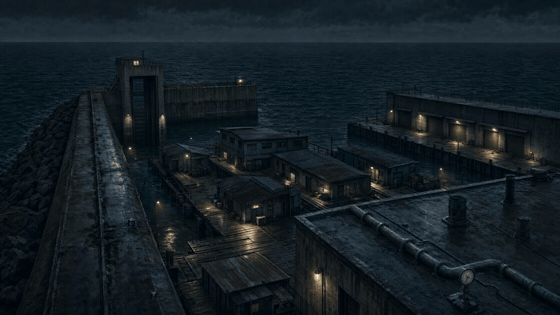
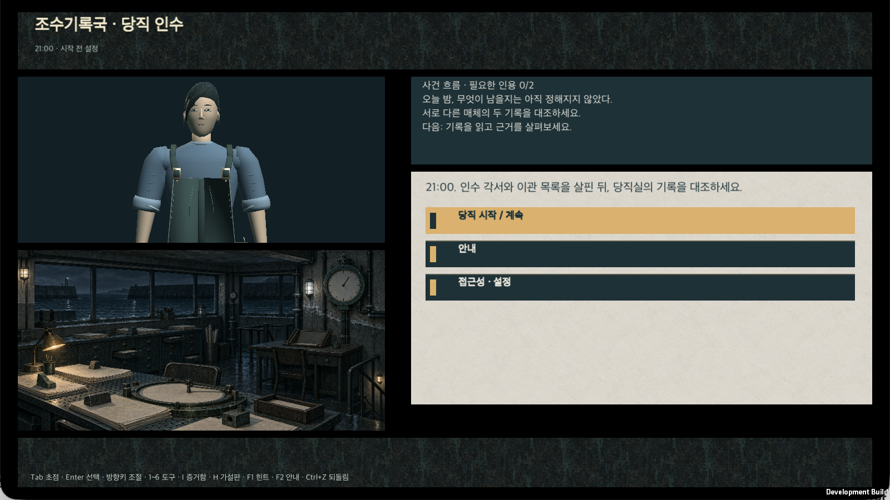
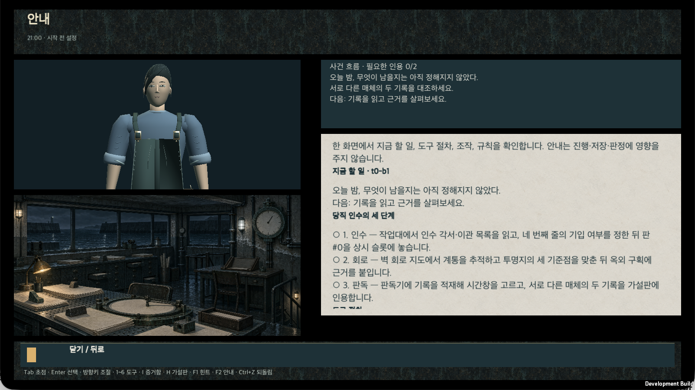
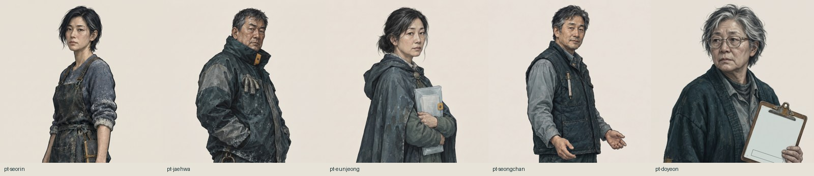
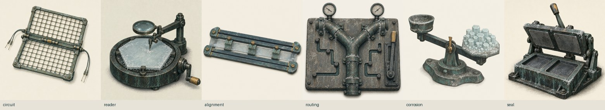
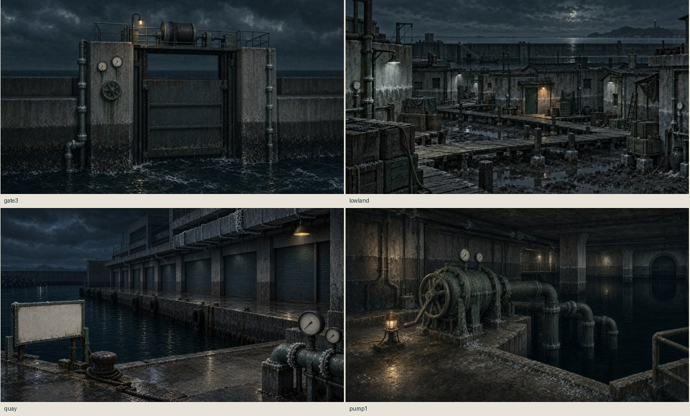
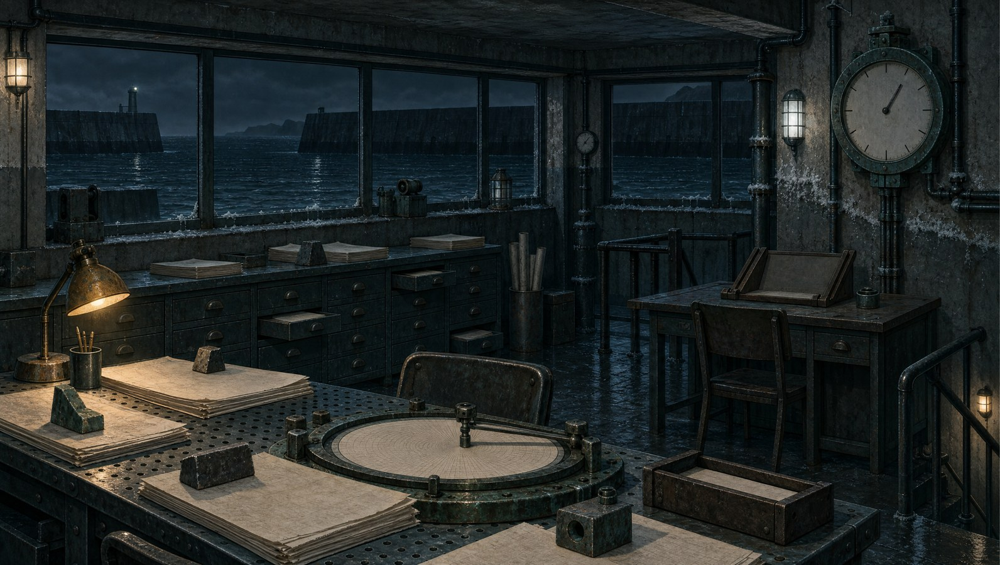

# 조수기록국: 마지막 당직 (가제)

> **Working title — unapproved.** 국문 가제와 영문 코드네임은 상표·동명 게임 확인 전이며 폴더명·번들명·상점명에 쓰지 않습니다. 저장소·Unity 프로젝트 코드네임은 `Unknown`입니다.
>
> 이 README의 모든 주장은 `[OBSERVED]`(실측) 또는 명시된 `[TARGET]`(설계 목표)입니다. 생성 이미지·영상은 **프리비즈이며 게임플레이가 아닙니다.** 사람 플레이테스트 n = 0.

**장르** 작업대·공간 추리 어드벤처 (2.5D 고정 시점, 싱글플레이) · **엔진** Unity 6000.5.6f1 · **플랫폼 목표** PC (macOS 개발 빌드 배포 중, Steam은 목표) · **언어** 한국어 / 영어 · **전투·유료 재화·멀티플레이·실시간 타이머 없음**

---

## 한 줄 소개

3주 전에 폐국을 고지한 조수기록국의 이관 전 마지막 야간 당직. 기록 복원사 **한서린**은 끊긴 염선 배선과 배수 경로를 **손으로 직접 바꾸고**, 그 결과로 달라진 항구를 다시 조사해 12년 전 **대조의 밤**에 사라진 **결손 4시간**의 진실을 청문 문서 한 건으로 확정합니다. 밤은 21:00에 시작해 05:00에 끝나고, 세 갈래 결말은 전부 본편 안에서 닫힙니다.

## 지금 플레이 가능한 것 · M25 (2026-09-18)

[](docs/media/m25/mo-opening-harbor.mp4)

| 시작 화면 | 안내 오버레이 (F2) |
|---|---|
|  |  |

위 두 장은 **실제 macOS 개발 빌드(`Unknown.app`, 316파일 / 438,910,587 B, digest `aaa5361d…`)의 창 캡처**입니다. OS 창틀만 잘라냈고 프레임·UI를 합성하지 않았습니다(에이전트 키 입력, 격리 저장 폴더). 오프닝 GIF는 같은 빌드가 재생하는 Higgsfield 클립의 파생본이며, 게임플레이 녹화가 아닙니다. 전체 목록과 해시: [`docs/media/m25/provenance.meta.md`](docs/media/m25/provenance.meta.md).

**M25에서 바뀐 것**

- **리소스 — Higgsfield CLI로 전량 생성·적용.** 배경 7(오프닝 은포항 야경·당직실·제3수문·구염전 저지대·냉동창고 부두·제1양수장·판독기 책상), 인물 초상 5, 도구 아이콘 6(캐논 형태 부호: 격자·팔 달린 원·평행선 2줄+눈금 3·분기 Y·육각 결정·겹친 사각), 모션 3(5 s / 720p / 무음). 시각 원전은 `concept/style-guide.md`와 원본 컨셉 시트뿐이며 현재 플레이 화면·프리팹은 참조하지 않았습니다. 이미지 내 텍스트·명판은 100% 크롭 검수로 반려·재생성했습니다(반려본 보존).
- **적용 범위.** 오프닝 정지 이미지 + 클립(모션 축소·재생 실패 시 정지 이미지), 시작 화면 당직실 배경, 도구 휠 아이콘, 안내 화면의 인물 카드(한서린·한도연)와 구역 도판. 임포터가 원본 SHA를 대조하고, 승격 감사 후 **로컬 개발 프로필만** 승인했습니다(`Resources/M25Resources.asset`). 원본 provenance는 `runtimeEligible:false`, 상업 사용권은 UNVERIFIED입니다.
- **튜토리얼·가이드.** 새 `안내` 오버레이(F2 · 툴바 · 시작 화면)가 지금 할 일(캠페인 목표), 당직 인수의 세 단계와 진행 표시, 도구 절차(배선 추적·판독), 조작, 규칙(힌트 무료·되돌림·2단계 확정·매체 2종), 인물, 항구의 네 구역을 한 화면에 모읍니다. 회로·판독 화면의 안내 접두는 `▶ 안내 · 단계 t0-b2 · 남은 조건 n개 · F2 전체 안내`로 구조화했습니다. 캠페인 데이터·힌트 본문은 바꾸지 않았습니다.
- **가독성.** 이름 있는 타이포 스케일 `TypeScale` — Display 30 · Title 24 · Body 21 · Section 18 · Label 18 · Status 17 · Helper 15 · Meta 14, 행간 1.15. 제목·섹션·상태는 굵게, 헬퍼는 표면 쪽으로 톤 다운. 계층 계약(본문 > 버튼 라벨 > 헬퍼, 라벨만 굵게)은 PlayMode 테스트로 고정되어 있습니다.
- **검증 [OBSERVED].** EditMode 65/65 · PlayMode 134(133 통과 / 0 실패 / 1 조건부 skip = `--t0-save-dir` 없는 boot 테스트) · 격리 boot 1/1 · 신규 M25 테스트 6/6. 영수증: [`_workspace/current/systems/tech-verification/m25/verification.json`](_workspace/current/systems/tech-verification/m25/verification.json).
- **배포.** GitHub Release **`v0.25.0-dev`**(prerelease)에 macOS 개발 빌드 zip을 첨부했습니다. 서명·공증이 없는 개발 빌드라 다른 Mac에서는 Gatekeeper 경고가 나며, 상점 공개가 아닙니다.

### 새 리소스 미리보기 (컨셉 · 게임플레이 아님)

| 인물 초상 (nano_banana_flash) | 도구 아이콘 (gpt_image_2) |
|---|---|
|  |  |



판독 동작 프리비즈: [`docs/media/m25/mo-reader-operation.mp4`](docs/media/m25/mo-reader-operation.mp4) · 당직실 정물: [`mo-hub-watchroom.mp4`](docs/media/m25/mo-hub-watchroom.mp4). 실제 실행 화면 추가 캡처: [`guide-overlay-tall.png`](docs/media/m25/guide-overlay-tall.png) · [`opening-motion-frame.png`](docs/media/m25/opening-motion-frame.png) · [`circuit-teaching-header.png`](docs/media/m25/circuit-teaching-header.png).

## 실행 · 빌드 · 테스트

**받아서 실행 (macOS)** — [Releases](https://github.com/akillness/unknown/releases)에서 `v0.25.0-dev` zip을 받아 압축을 풀고 `Unknown.app`을 엽니다. 미서명 개발 빌드이므로 처음 실행 시 우클릭 → 열기가 필요할 수 있습니다. 저장 폴더는 `~/Library/Application Support/TideRegistry/Unknown T0/saves/`이며 `--t0-save-dir <폴더>` 인자로 바꿀 수 있습니다.

**소스에서 실행** — Unity Hub에 `unity/Unknown/`을 추가하고 **Unity 6000.5.6f1**로 엽니다. `Assets/_Project/Scenes/boot.unity`가 자동으로 열리며 Play로 허브·회로·판독·설정·저장 흐름을 실행합니다.

```bash
UNITY_EDITOR="/Applications/Unity/Hub/Editor/6000.5.6f1/Unity.app/Contents/MacOS/Unity"
P="$PWD/unity/Unknown"

# macOS 개발 플레이어 → unity/Unknown/Builds/T0-mac/Unknown.app (gitignored)
"$UNITY_EDITOR" -batchmode -quit -projectPath "$P" \
  -executeMethod Tide.EditorTools.T0ProjectBuilder.BuildMac -logFile /tmp/unknown-build.log --burst-disable-compilation

# 테스트 (EditMode는 -nographics, PlayMode는 UI 대비 검사 때문에 그래픽 필요)
"$UNITY_EDITOR" -batchmode -nographics -projectPath "$P" -runTests -testPlatform EditMode \
  -testResults /tmp/editmode.xml -logFile /tmp/editmode.log
"$UNITY_EDITOR" -batchmode -projectPath "$P" -runTests -testPlatform PlayMode -assemblyNames Tide.Tests.Play \
  -testResults /tmp/playmode.xml -logFile /tmp/playmode.log --burst-disable-compilation
"$UNITY_EDITOR" -batchmode -projectPath "$P" -runTests -testPlatform PlayMode -testFilter Tide.Tests.T0BootSceneTests \
  -testResults /tmp/boot.xml -logFile /tmp/boot.log --t0-save-dir /tmp/unknown-c1-m4-boot-$(date +%s)

# M25 리소스 재임포트(원본 SHA 대조) · 승인은 감사 후 별도
"$UNITY_EDITOR" -batchmode -nographics -quit -projectPath "$P" -executeMethod Tide.EditorTools.M25ResourceProjectBuilder.Import -logFile /tmp/m25-import.log
```

**조작** — Tab 초점 · Enter 선택 · 방향키 조절 · 1~6 도구 · I 증거함 · H 가설판 · **F1 힌트 · F2 안내** · Ctrl+Z 되돌림 · Esc 뒤로. 게임패드 지원, 설정에서 키 재지정·글자 배율(1.0~1.5)·모션 축소·확정 방식(프리뷰 후 확정 / 누르고 놓기 / 대화상자)을 바꿀 수 있습니다.

## 세 기둥

1. **행동으로 추리한다.** 단서를 모으는 데서 끝나지 않고 배선·경로·기록의 가설을 손으로 시험합니다.
2. **같은 장소가 다르게 읽힌다.** 새 지역을 늘리는 대신 허브 1곳 + 구역 4곳을 상태 변화로 재사용합니다.
3. **본편만으로 닫힌다.** 도시의 위기, 사건의 책임, 주인공의 선택이 본편에서 끝납니다. DLC는 다른 사건입니다.

## 여섯 개의 동사 — 세계의 여섯 법칙과 1:1

| 동사 | 대응 법 | 연습(sandbox)에서 | 확정(commit)에서 |
|---|---|---|---|
|  **배선 추적** `circuit` | 배선된 것만 남는다 | 계통선을 따라 센서 범위 안/밖을 비교 | 확정 없음 — 배선 밖 근거를 무효로 만든다 |
|  **판독** `reader` | 원본은 닳지만 사본은 남는다 | 검증 사본을 무제한 재생·확대 | 판독 결과를 가설판에 출처와 함께 고정 |
|  **조위정합** `alignment` | 정합 전 시계는 믿지 않는다 | 공통 피크 3개를 잡으며 잔차를 실시간 확인 | 잔차 ≤ 4분일 때 두 자료의 시간축을 잇는다 |
|  **배수 편성** `routing` | 이번 조수에는 보호 용량이 부족하다 | 두 경로를 대기 상태로 편성해 결과를 미리 본다 | 우선순위를 확정해 구역 상태를 실제로 바꾼다 |
|  **부식 시험** `corrosion` | 소금은 비용으로 보인다 | 구성안을 가상 시험대에 무제한 올린다 | 한도 안의 구성만 배수 편성 확정으로 넘긴다 |
|  **이중서명** `seal` | 원본 책임과 제출을 나눈다 | 결론 카드에 근거 슬롯을 채워 본다 | 서로 다른 매체 2종 + 배선 범위 안 + 시간 근거로 제출 |

모든 조작은 **연습(무제한·무료·세계 불변)** 과 **확정(프리뷰 → 저장 성공 후에만 세계 변경)** 두 층으로만 존재합니다. 힌트 3단계는 무료·무제한이고 엔딩·평가에 영향이 없습니다. 현재 플레이 가능한 슬라이스(T0 → C1-b2)에서는 배선 추적·판독이 열려 있고, 조위정합은 본편과 격리된 연습장으로 제공됩니다.

## 세계

은포항(銀浦)은 대조차 9.2 m의 반폐쇄 만입니다. 방조제 → 갑문·수문 → 양수장의 3중 방어를 **염선**(브라인 도관)의 압력·염도가 회로처럼 잇고, 그 신호는 **염판**에 12시간 링으로 각인됩니다. 염판은 밸브 개폐·압력·염도·수위·문 개폐·호출만 남기고 얼굴·의도·대화 내용·사람의 위치는 남기지 않습니다. 과거는 재생되지 않고 **서로 다른 매체 2종의 대조로만 추론**됩니다.



세계관 바이블·연표·용어집: [`_workspace/current/worldview/`](_workspace/current/worldview/) · 캠페인 33비트(정본 JSON): `_workspace/current/planning/campaign.json` · 시각 규범: `_workspace/current/concept/style-guide.md`(팔레트 8색 + 예비 1, 재질·카메라·형태 부호, 금지 사항).

## 이전 마일스톤 (요약 · 증거는 각 폴더)

| 마일스톤 | 내용 | 증거 |
|---|---|---|
| **M24** (09-14) | Blender MCP로 한서린 얼굴·머리·작업복 마감(19,618 tri / 50본), 실제 창 녹화 18 s | [`docs/media/gameplay-m24/`](docs/media/gameplay-m24/) · `systems/tech-verification/m24/` |
| **M23** (09-14) | 두 기록 동시 비교, 서명 근거·출처 계보, 격리된 조위정합 연습장, 스크롤 유지 저장 피드백, off-reader pin 수명 교정 | `systems/tech-verification/m23/` |
| **M22** (09-13) | Blender 저작 한서린과 조작용 양손을 기본 빌드에 적용, 힌트 제안 리듬·모션 축소·앱 일시정지 계약 | [`docs/media/gameplay-m22/`](docs/media/gameplay-m22/) |
| **M20–M21** | 작업면 후보(진단 전용)와 판독 가독성 밴드 | `presentation/t0-work-surface-m20.md` |
| **M9 · M8** | 완성도 hop(힌트 지속·2단계 확정·프리뷰 diff·안내 접두), 오프라인 검토 노트 | [`docs/media/gameplay-m9/`](docs/media/gameplay-m9/) |
| **M7** (09-11) | 원본 컨셉 우선 시네마틱·GTI 재질·Blender 블록아웃 | [`docs/media/concept-first-m7/`](docs/media/concept-first-m7/) |
| **M5 · M6** | 영상에서 게임 연출로(정지 오프닝·방향 스트립), 시네마틱 비교 | [`docs/media/intro-gameplay-m5/`](docs/media/intro-gameplay-m5/) · [`docs/media/cinematic-gameplay-m6/`](docs/media/cinematic-gameplay-m6/) |
| **T0 M2 → C1 M4** (09-10 → 09-11) | 허브·회로·판독·저장/복구·undo/redo, C1 「순찰로의 두 분기」·「겹쳐 붙은 서명지」 | `_workspace/current/production/changelog.md` |
| **C1–C7 사전제작** (09-09 → 09-10) | 세계관·캠페인 33비트·시스템·밸런스·경제·제품·연출 문서, 5회 독립 검토 | `_workspace/current/`, 아카이브 `_workspace/archive/` |

초기 프리비즈(GTI 프레임 GIF·그레이박스 턴테이블)는 [`docs/media/`](docs/media/) 루트와 `docs/media/provenance.json`에 그대로 보존되어 있습니다.

## 저장소 구조

```
CLAUDE.md                        저장소 운영 규칙 (14역할 + 디렉터 하네스, 게이트 G1~G8, 사이클 계약)
.mex/ROUTER.md                   세션 부트스트랩·프로젝트 상태·라우팅
_workspace/current/              살아 있는 산출물 (레인별 폴더, frontmatter 필수)
_workspace/archive/              대체된 이전 판본 (읽기 전용, supersedes 로 연결)
_workspace/current/handoff/      구현 핸드오프 브리프 · 검증 계획 · 리소스 런북
_workspace/current/systems/tech-verification/m25/   M25 영수증 (verification.json, import-audit, build-inventory, NUnit XML)
unity/Unknown/                   Unity 6000.5.6f1 프로젝트 (in-repo) — Assets/_Project/{App,UI,Presentation,Sim,Data,Save,Input,Editor,Tests}
assets/generated/{2d,3d,video,previz,audio}/   생성 리소스 + provenance.json (승격 전 runtimeEligible:false); M25 = 2d/m25, video/m25
docs/media/                      README 미디어 (파생본) + provenance; docs/media/m25 = 이번 캡처·프리비즈
scripts/                         gen-higgsfield.py (M25) · gen-2d.sh (GTI) · gen-video-higgsfield.sh · make-previz-gif.sh
                                 refresh-2d-provenance.py · regen-cycle-ledger.py · qa_m7_texture_tiling.py · blender/
```

## 개발용 준비와 정본 재생성

기획·구현 작업은 `CLAUDE.md` → `.mex/ROUTER.md` → `_workspace/current/handoff/README.md` 순서로 계약을 확인합니다. `Prepare`는 프로젝트에 포함된 테이블을 읽고 부모 작업 트리의 `_workspace/current/planning/campaign.json` SHA를 검증한 뒤 씬을 준비합니다. 저작 문서에서 테이블을 생성하는 명령이 아니며, 이 경로에는 부모 캠페인 파일이 필요합니다.

```bash
node _workspace/current/planning/validate-campaign.mjs
node _workspace/current/planning/validate-campaign.mjs --t0 _workspace/current/systems/data/t0
"$UNITY_EDITOR" -batchmode -nographics -quit -projectPath "$PWD/unity/Unknown" \
  -executeMethod Tide.EditorTools.T0ProjectBuilder.Prepare -logFile /tmp/unknown-t0-prepare.log
bash .claude/skills/game-ops-harness/scripts/freshness-check.sh
```

정본부터 테이블을 재생성하는 도구는 `_workspace/current/systems/pipeline/emit-tables.mjs`입니다(`Data/Tables/*.json`은 손으로 쓰지 않습니다). M25 리소스 재생성: `python3 scripts/gen-higgsfield.py _workspace/current/concept/m25-higgsfield-jobs.json [--only id,…] [--dry-run]` — Higgsfield 크레딧을 소모하므로 전후 `higgsfield account status`를 영수증으로 남깁니다.

## 리소스 출처와 라이선스

| 종류 | 도구 | 출처 기록 |
|---|---|---|
| M25 배경·초상·아이콘·모션 (2026-09-18) | **Higgsfield CLI 1.1.25** — `gpt_image_2`, `nano_banana_flash`, `seedance_2_0` | `assets/generated/2d/m25/*/provenance.json`, `assets/generated/video/m25/provenance.json` (작업 ID·참조 해시·잔액 전후) |
| 2D 컨셉 45장·M7 재질 (09-10 → 09-11) | `god-tibo-imagen`(GTI, Codex 백엔드, `gpt-6-astra`) | `_workspace/current/concept/prompts/`, 각 폴더 `provenance.json` |
| 3D 인물·소품 | Blender 5.1.2 (MCP / CLI) — 외부 모델 없음 | `assets/generated/3d/**/provenance.json`, `scripts/blender/` |
| 이전 영상 프리비즈 | Higgsfield `seedance_2_0_mini`, `minimax_hailuo` | `assets/generated/video/provenance.json`, `assets/generated/previz/` |

- 생성물의 상업 이용 가능 여부는 **각 백엔드 약관 확인 전까지 UNVERIFIED**입니다. 모든 원본 항목은 `runtimeEligible:false`로 시작하며, Unity 프로필 승인은 로컬 개발 빌드에 한정된 별도 감사입니다(`_workspace/current/production/decision-log.md`).
- 실존 재난·피해자·타 작품 설정을 차용하지 않았습니다. 수문·염선 기술은 창작이며 현실 안전 매뉴얼이 아닙니다. 인물의 선악은 외모로 부호화하지 않습니다.

## 측정하지 않은 것

사람 플레이테스트(n = 0), 재미·몰입·플레이타임(480분은 `[TARGET]`), 성능(런타임 tri/drawcall/텍스처 상주), Windows 빌드, 전체 캠페인 완결성. 게이트 G1~G8은 PASS 0 / G8 PARTIAL(메모리 동기 영수증 일부 미검증)로 남아 있습니다. 이 저장소가 약속하는 것과 하지 않는 것: `_workspace/current/production/premium-preproduction-contract.md`.

---

*Generated content is pre-visualization, not gameplay. Human playtest n = 0. Development build only — unsigned, not a store release. See `CLAUDE.md` for the studio contract.*
